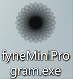
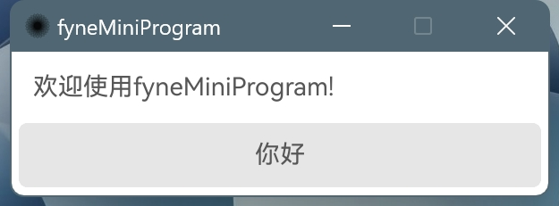
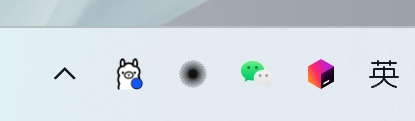
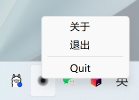

# fyneMiniProgram

> 这是一个支持托盘的程序模板。目的是为了提供一个让一些go程序更加友好的启动方式。例如你开发了一个用go编写的本地使用的工具，那么你可以 clone 当前项目，把当前项目作为你go项目的入口。通过fyne，你可以可以分发一个可以双击执行，并且可以缩小到系统托盘（指的windows左下角，或者mac的top栏）的执行程序。

> 本项目只是作为一个系统托盘程序的模板。后续维护也会以托盘程序模板为终点进行维护

## 操作流程

克隆项目
```
git clone https://github.com/leancodebox/fyneMiniProgram.git
```

```
-- 在合适的位置编写你的代码
```

打包编译

```
go install fyne.io/fyne/v2/cmd/fyne@latest # 安装 fyne cmd
fyne package -os darwin -icon resource/logo.png # mac加入图标打包
fyne package -os linux -icon resource/logo.png  # linux加入图标打包
fyne package -os windows -icon resource/logo.png # windows加入图标打包
```

## 效果展示

### 打包产物
<p align="center">
  
</p>

### 主页面

<p align="center">
  
</p>

### 系统托盘

<p align="center">
  
</p>

### 托盘菜单

<p align="center">
  
</p>
